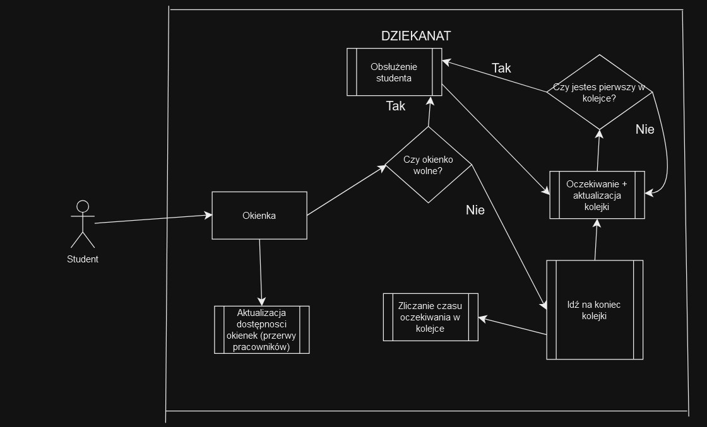

# Symulacja pracy dziekanatu W4

---

## Obiekt
Dziekanat Wydziału W4, obsługujący kierunki:
- Inżynieria systemów  
- Informatyka stosowana  
- Cyberbezpieczeństwo  

---

## Cel
Ocena efektywności pracy dziekanatu oraz identyfikacja optymalnych strategii obsługi studentów w zależności od parametrów takich jak liczba pracowników, sposób organizacji okienek i kolejek.

---

## Hipotezy
1. Jeśli kolejka jest priorytetyzowana (np. posortowana od najszybszych spraw), to średni czas oczekiwania się skróci.  
2. Jeśli będziemy losować studentów z kolejki, to średni czas oczekiwania będzie krótszy niż przy FIFO.  
3. Istnieje optymalna liczba stanowisk, powyżej której nie skróci się średni czas oczekiwania.  
4. Przy podziale na kierunki, średni czas oczekiwania jest krótszy niż przy podziale na specjalności lub przy braku podziału.

---

## Wejścia:
- Liczba studentów przychodzących do dziekanatu w określonych godzinach.  
- Typy spraw studentów: odbiór dokumentów, składanie wniosków, pytania informacyjne.  
- Czas obsługi pojedynczego studenta w zależności od rodzaju sprawy.  
- Liczba stanowisk obsługi oraz liczba pracowników.   

## Zakłócenia:
- Nieregularne napływy studentów (np. w szczytach związanych z rejestracją, składaniem podań).  
- Nieobecność pracowników (choroby, urlopy).  
- Studenci z wydłużonym czasem obsługi (np. złożone sprawy, błędne dokumenty).  

---

## Wyjścia
- Czas oczekiwania studentów w kolejce.
- Średni czas obsługi jednego studenta.  
- Wykorzystanie pracowników.  

---

## Parametry

| **Kategoria**  | **Deterministyczne**                                                        | **Losowe**                                                         |
|----------------|-----------------------------------------------------------------------------|--------------------------------------------------------------------|
| **Zmienne**    | - Podział okienek                                                           | - Czas trwania obsługi zależny od rodzaju sprawy i doświadczenia pracownika |
|                | - Średni czas przyjścia następnego studenta                                 |   |
|                | - Organizacja kolejki/kolejek (FIFO, losowe przydzielanie, priorytetyzacja) |   |
| **Niezmienne** | - Liczba stanowisk obsługi                                                  | - Liczba nieobecnych pracowników                                   |

---

## Wskaźniki oceny:

- Średni czas oczekiwania
- Maksymalny czas oczekiwania
- Wykorzystanie pracowników

---

## Model Konceptualny

### **Opis systemu**
Model symuluje pracę dziekanatu Wydziału W4, obejmującego obsługę studentów trzech kierunków: Inżynieria Systemów, Informatyka Stosowana, i Cyberbezpieczeństwo. System uwzględnia przybywanie studentów, ich obsługę przez pracowników dziekanatu oraz zakłócenia wynikające z nieregularności w napływie studentów i dostępności zasobów.

### **Elementy modelu**
- **Studenci:** Każdy student przychodzący do dziekanatu ma przypisany:
  - Rodzaj sprawy (odbiór dokumentów, składanie wniosków, pytania informacyjne),
  - Kierunek studiów (Inżynieria Systemów, Informatyka Stosowana, Cyberbezpieczeństwo),
  - Czas obsługi, zależny od rodzaju sprawy.

- **Pracownicy dziekanatu:**
  - Każdy pracownik obsługuje jednego studenta na raz i jest przypisany do konkretnego okienka.
  - Pracownik obsługuje konkretny rodzaj spraw i/lub konkretny kierunek/kierunki studiów.
  - Status pracownika (wolny, zajęty, niedostępny) zmienia się w zależności od aktywności w systemie.

- **Dziekanat:**
  - Liczba stanowisk obsługi definiuje maksymalną liczbę pracowników dostępnych jednocześnie.
  - Godziny otwarcia określają okres aktywności systemu.
  - Kolejka studentów jest zarządzana według różnych zasad (FIFO, losowe przydzielanie, priorytetyzacja).

### **Zdarzenia w systemie**
1. **Przyjście studenta:** Nowy student pojawia się w systemie w losowym odstępie czasu. Rodzaj sprawy, czas obsługi i kierunek studiów są przypisywane na podstawie rozkładu prawdopodobieństwa, biorąc pod uwagę zakłócenia.
2. **Rozpoczęcie obsługi:** Wolny pracownik rozpoczyna obsługę studenta. Czas obsługi zależy od rodzaju sprawy i ewentualnych zakłóceń.
3. **Zakończenie obsługi:** Obsłużony student opuszcza system, a pracownik staje się wolny.
4. **Zakłócenia:** Mogą wystąpić losowe opóźnienia wynikające z nieregularności w napływie studentów, błędów w dokumentach, lub niedostępności pracowników.

### **Założenia**
- Liczba studentów przybywających do dziekanatu oraz czas między ich przyjściami są generowane na podstawie rozkładu wykładniczego z określonymi parametrami.
- Czas obsługi zależy od rodzaju sprawy i ewentualnych zakłóceń.
- System działa w określonych godzinach (np. dziekanat otwarty od 8:00 do 15:00).
- Kolejka jest obsługiwana zgodnie z zaimplementowaną strategią (FIFO, losowe przydzielanie, priorytetyzacja).

### **Przepływ procesu**
1. Studenci przychodzą do dziekanatu i ustawiają się w kolejce.
2. Pracownicy przyjmują studentów zgodnie z regułami organizacji kolejki.
3. Po zakończeniu obsługi student opuszcza system, a pracownik przechodzi do obsługi kolejnego studenta.
4. Proces powtarza się do zamknięcia dziekanatu lub obsłużenia wszystkich studentów w kolejce.
